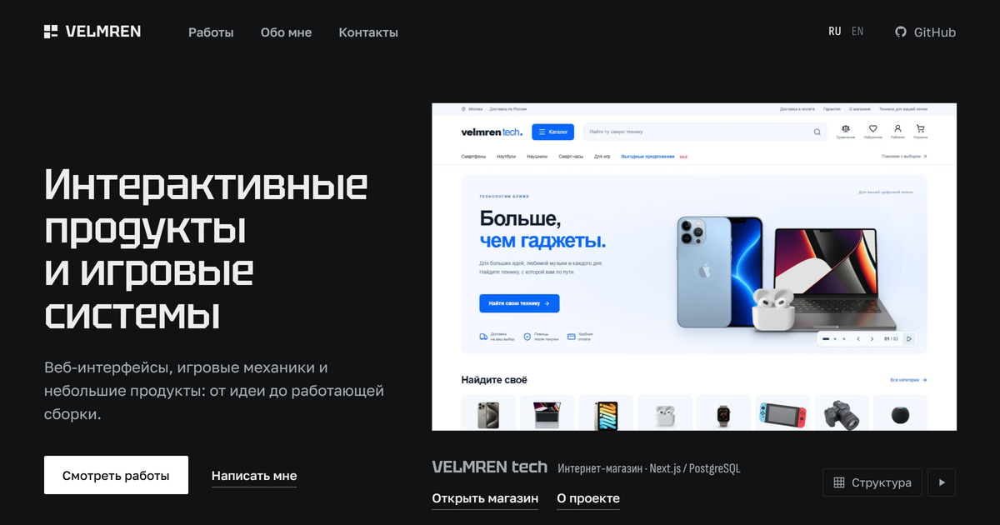

# VELMREN portfolio

Source of [velmren.com](https://velmren.com): a static Next.js site with case pages and live builds of web, game and Minecraft projects.



Live site: https://velmren.com (Russian) and https://velmren.com/en/ (English).

## What it does

- The home page shows a rotating board of works with category tabs. Its content comes from `src/content/home.json`.
- Every project has a case page built from one JSON file in `src/content/projects/`. Sections such as media, features, flow, architecture, code and links are validated with Zod and rendered by shared components, so a new project needs no page code.
- Russian pages live at plain paths, English pages under `/en/`. A page always opens in the language of its address. A first-time visitor whose browser speaks the other language sees a note that offers that version.
- The site is a static export. There is no Node.js server, database or admin panel at runtime. Some projects ship their own static builds, which are served from `/projects/<name>/` and `/forma/live/`.

## Projects

| Project | Description | Links |
| --- | --- | --- |
| FORMA | Catalogue of twelve home objects in seven materials: filters, a product page with a dimensioned drawing, comparison at one scale and a selection. Russian and English. | [Case](https://velmren.com/en/forma/), [live](https://velmren.com/forma/live/), [source](https://github.com/Velmren/forma-component-catalog-study) |
| ORBIT | Operations panel for a fictional online store: orders, payments, stock, tasks and customer messages linked together. Russian and English. | [Case](https://velmren.com/en/admin-dashboard/), [live](https://velmren.com/projects/admin-dashboard/), source in `new-projects/admin-dashboard/` |
| Category Spark | Godot 4 quiz: six questions in three categories, a score and a new round. Runs in the browser and on Windows. | [Case](https://velmren.com/en/godot/), [play](https://velmren.com/assets/godot/web/), [source](https://github.com/Velmren/category-spark-godot) |
| Encounter State | Paper plugin for Minecraft Java Edition: switch on the relays, defeat the sentinels, hold the zone and seal the rift. | [Case](https://velmren.com/en/encounter/), [plugin JAR](https://velmren.com/assets/java/encounter-state-demo-0.2.0.jar), [source](https://github.com/Velmren/minecraft-encounter-state-demo) |
| Dev Utilities | Browser app with JSON, colour, hash and Base64 tools. Works without a server, in Russian and English, light and dark. | [Case](https://velmren.com/en/dev-utilities/), [live](https://velmren.com/projects/dev-utilities/), source in `new-projects/dev-utilities/` |
| Light Variant | Tilda website for an interior studio: home page, three apartment concepts, services with stages, a quiz and a form. | [Case](https://velmren.com/en/tilda-interior/), [live](https://politely-able-rhino.tilda.ws/) |
| VELMREN tech | Electronics store from search to checkout, with customer accounts and catalogue management. | [Case](https://velmren.com/en/electronics-store/), [live](https://shop.velmren.com), source in `new-projects/electronics-store/` |
| SONO | Landing page for a wireless speaker concept: two models, a comparison, a configurator, a bag and an enquiry form. Russian and English. | [Case](https://velmren.com/en/sono/), [live](https://velmren.com/projects/electronics/), source in `new-projects/electronics/` |

## Tech stack

Next.js 16 (App Router, static export), React 19, TypeScript 7, Zod 4, Motion and Radix Select. Tests use the Node.js test runner.

## Getting started

Prerequisites: Node.js 24 and npm. The build downloads the site fonts from Google Fonts through `next/font`, so it needs network access.

```sh
npm ci
npm run dev          # http://127.0.0.1:3000
npm test
npm run typecheck
npm run build        # static site in out/
```

`npm run build` runs `next build` and then `scripts/prepare-export.mjs`. The script copies the FORMA build from `demos/forma/` to `out/forma/live/`, removes media used only by draft projects, and normalises the segment file names that Next.js writes with path separators on Windows. Serve `out/` with any static file server.

The browser build of Category Spark is not committed. To include it, install Godot 4.7.2 with the Web export templates and run:

```sh
GODOT=/path/to/godot node scripts/build-category-spark-web.mjs
```

It exports the game from `public/assets/godot/CategorySpark-source.zip` into `public/assets/godot/web/`.

`npm run package:release` packs `out/` and the FORMA build into `output/deploy/<version>/` together with a manifest of file sizes and SHA-256 hashes. Run it after `npm run build`; it needs `git` and `tar`.

## Adding a project

1. Create `src/content/projects/<slug>.json` using an existing file as a template. The file name must match `slug`, and the slug is the public URL.
2. Put screenshots and videos in `public/assets/<slug>/` and give every image its width, height and alt text.
3. Set `"presentation": "case"` and add English texts in the `en` field to get a page under `/en/<slug>/`.
4. Add the work to `src/content/home.json` to show it on the home page.
5. Run `npm test`, `npm run typecheck` and `npm run build`.

A project with `"status": "draft"` stays in the source but is left out of routes, the sitemap and the export.

## Project structure

```
src/app/            routes: home, /<slug>/ case pages, /en/ versions, sitemap and robots
src/components/     home board, case page and shared sections
src/content/        home.json and projects/*.json
src/lib/            schemas, data loading, filters, languages and social previews
public/assets/      screenshots, videos and downloads used by the case pages
public/projects/    static builds of individual projects
new-projects/       sources of those builds
demos/forma/        prebuilt FORMA catalogue, published at /forma/live/
scripts/            export post-processing, release packaging and the Category Spark web build
tests/              tests for project data, the home page and English texts
docs/               third-party assets and licences
```

`PROJECT_STRUCTURE.md` has the full file map.

## Credits

- Godot logo in `public/assets/brands/godot.svg`: Andrea Calabró, CC BY 4.0. The notice is in `public/assets/brands/godot-LICENSE.txt`. The logo marks the engine on the Category Spark page and does not imply endorsement by the Godot project.
- Site fonts Golos Text, Tektur and Sofia Sans Condensed are fetched from Google Fonts at build time. SIL Open Font License 1.1.
- Fonts bundled with project builds are licensed under the SIL Open Font License 1.1, with the licence text next to the font files: Onest (`demos/forma/`), IBM Plex Sans and IBM Plex Mono (`public/projects/dev-utilities/`, and in `new-projects/game-concept/` as the renamed subset Lacuna Text), Tektur (`new-projects/game-concept/`), Inter and Caveat (`public/projects/admin-dashboard/`), Nunito, Rubik, PT Sans and Noto Serif (inside the Lumi web build in `public/projects/mobile-game/`).
- three.js, MIT, in `new-projects/game-concept/vendor/three/` and `public/projects/game-concept/vendor/three/`.
- JSONPath Compliance Test Suite, BSD 2-Clause, used as a test fixture in `new-projects/dev-utilities/tests/fixtures/jsonpath-cts/`.
- Brand logo and product image sources for VELMREN tech are listed in `new-projects/electronics-store/docs/`.

Details for each item are in [docs/THIRD-PARTY.md](docs/THIRD-PARTY.md).
